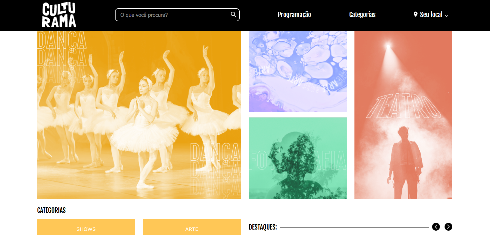

## 📸Imagem do projeto

  

## 🖥️Sobre o projeto
Esse é um projeto de uma página de eventos chamada Culturama, foi baseado em um <a href="https://www.figma.com/design/mC6DmuXPGWHYkMWOQD3khm/2713---Praticando-CSS%3A-Grid-e-Flexbox?node-id=79-289">modelo do figma</a> disponibilizado pela Alura.

## 🚀Tecnologias utilizadas
Esse projeto foi desenvolvido durante o curso de HTML e CSS da Alura com as seguintes tecnologias: 
-HTML 
-CSS 
-Git e GitHub 
-Figma 